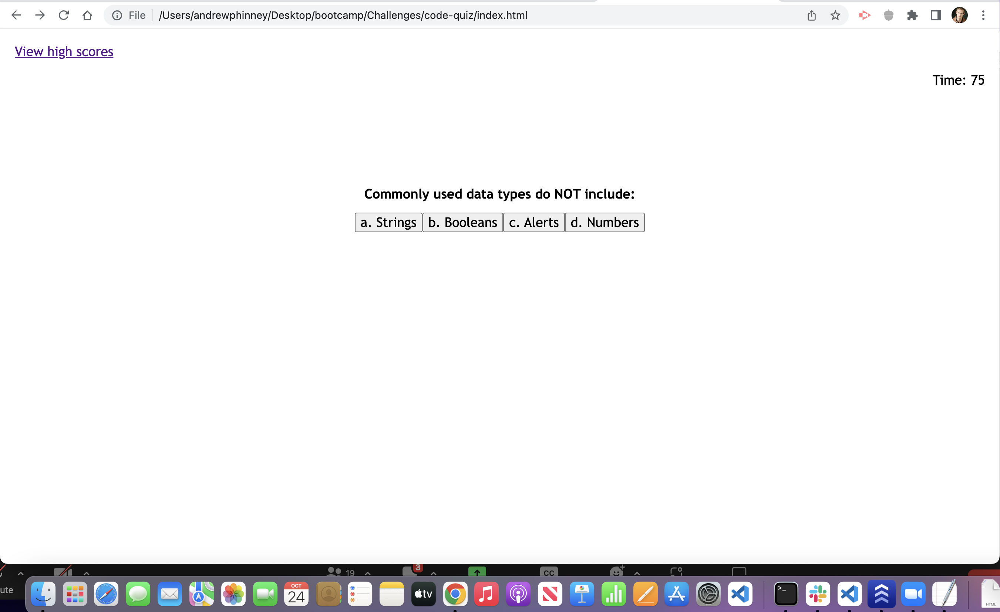
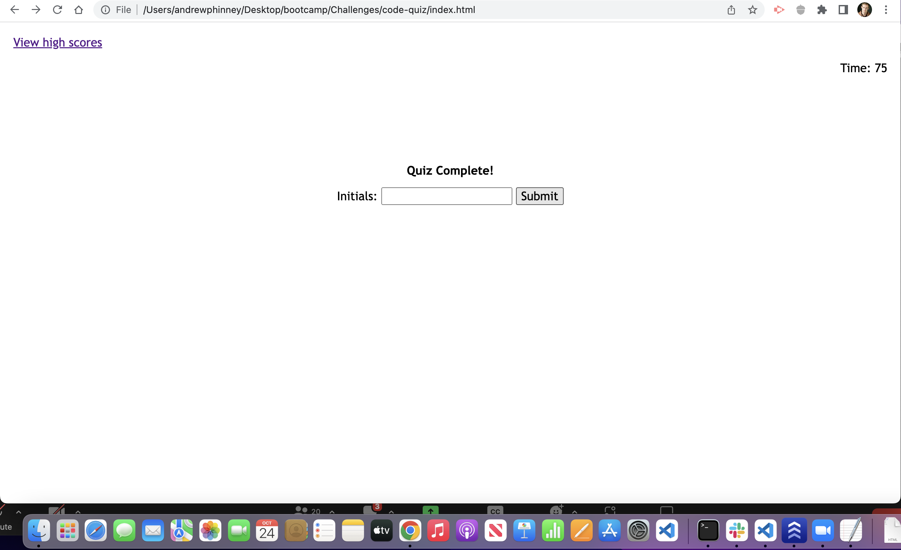

# code-quiz

## Description
I created this app in order to practice using JavaScript and APIs. I was hoping that the end result would provide a fun interactive way to test one's knowledge of coding. The app solves the problem not being able to text your knowledge of coding. I learned that I still have a lot to learn about javaScript and APIs.

## Installation
In order to try out the quiz, go to https://aphinney0516.github.io/code-quiz/ and click "start" (see the screen shot below).

## Usage
Once you hit the "start" button in the above screenshot you will go through 5 multiple choice questions per the screenshot example below.

Once you have completed all 5 multiple choice questions you will be prompted to enter your initials with the intention of them being saved along with your score per the screenshot below.

If you click on the "View high scores" link in the upper lefthand corner you will be taken to a separate page that is intended to contain intials and high scores. The high scores were supposed to be based on how much time is left on the timer. Unfortunately, as implied by some of the phrases I have used here, I was unable to finish all of the functions to make this app fully functional.

## Credits
I got started on this app with the help of my tutor Corey Yates.

